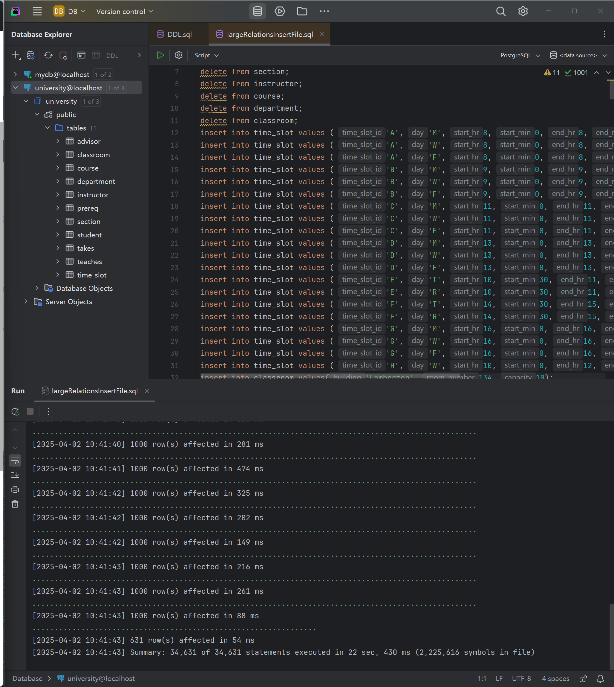
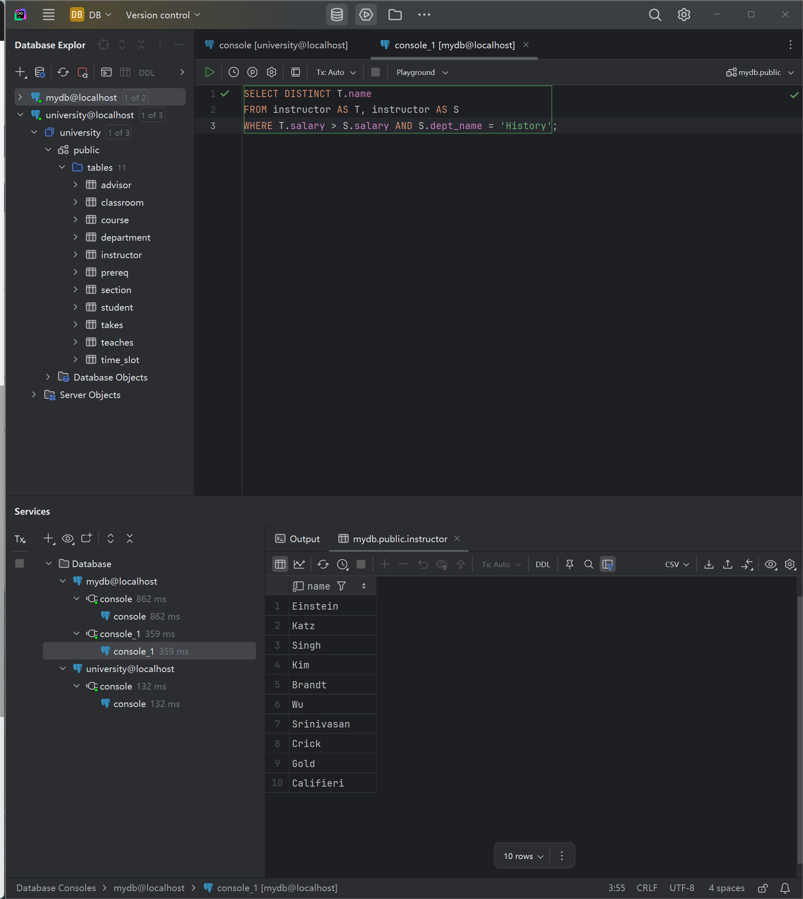
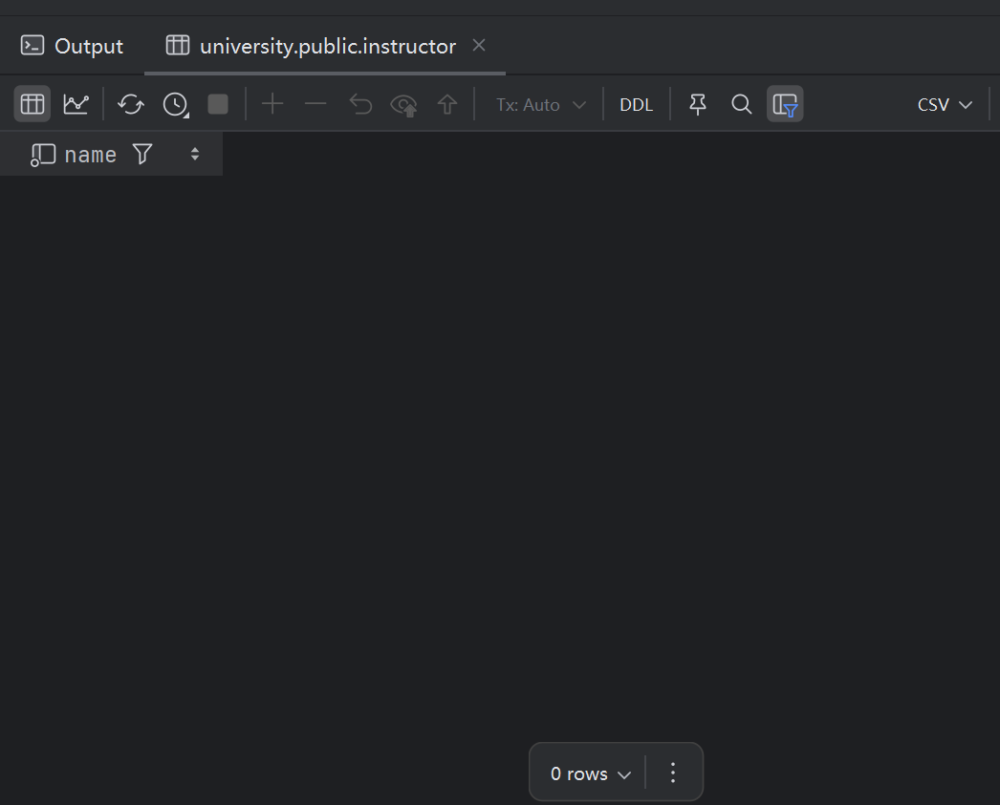
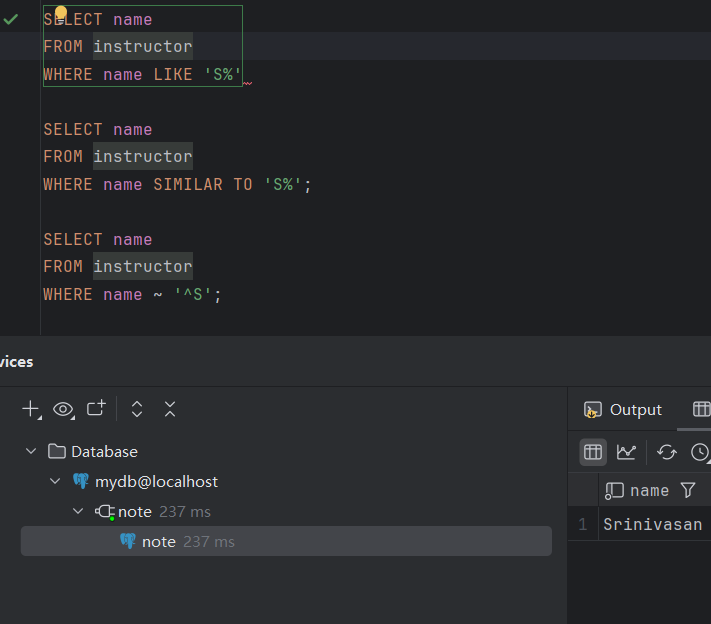
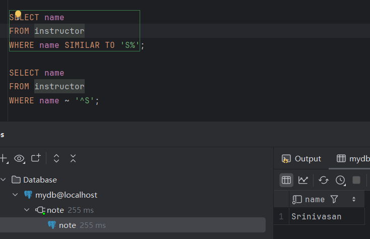
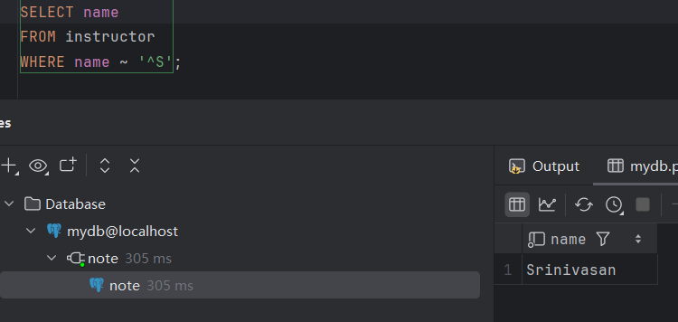
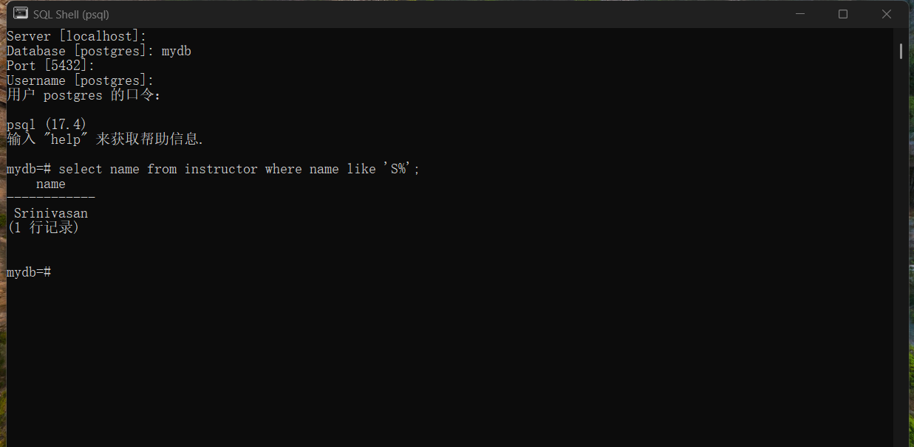
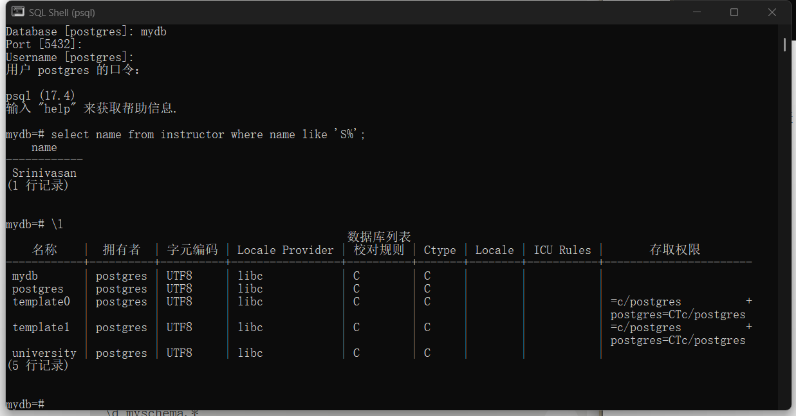
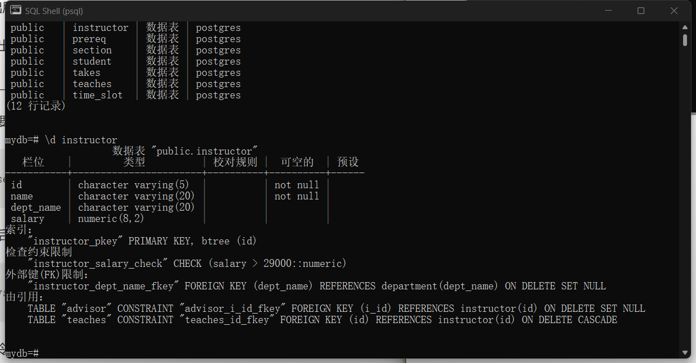

# 实操


## 题目一（3分+1分）


1. 新建一个`university`数据库，并执行`largeRelationsInsertFile.sql`，导入数据。

   > 创建数据库：SQL Shell (enter/enter/enter/enter/password) + CREATE DATABASE mydb;
   >
   > data grip导入【+ data source，用户名postgres，记得加密码，选定数据库】
   >
   > 可以在pgAdmin4可视化检查情况
   >
   > 导入数据前需要现有数据表，先导入DDL，然后进行insert

   

2. 运行第2次作业的题目三代码。注意：把原题目中的`会计`改成`History`。

```sql
SELECT DISTINCT T.name
FROM instructor AS T, instructor AS S
WHERE T.salary > S.salary AND S.dept_name = 'History';
```

👇mydb



👇university




## 题目二（3分）

###### 参考[Pattern Matching](https://www.postgresql.org/docs/17/functions-matching.html)，在PG中使用至少三种方法实现找到所有以`S`开头教师的名字。

#### 1. LIKE

仅支持'-' & '%'



#### 2. SIMILAR TO [TIME OUT]

和LIKE差不多，但支持中等复杂正则匹配



#### 3. POSIX [TIME OUT]

支持复杂正则匹配，明显感觉慢了点




## 题目三（3分）

`psql`是PostgreSQL的命令行工具。请使用`psql`命令行工具：

注意选择需要的database，之前全跳过的部分是有含义的

- 实现题目二

  

- 列出所有的数据库`\l`

  

- 列出数据库的所有表`\dt`

  

- 显示某张表的关系模式`\d table_name`

