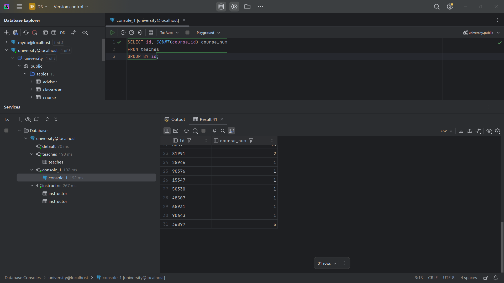
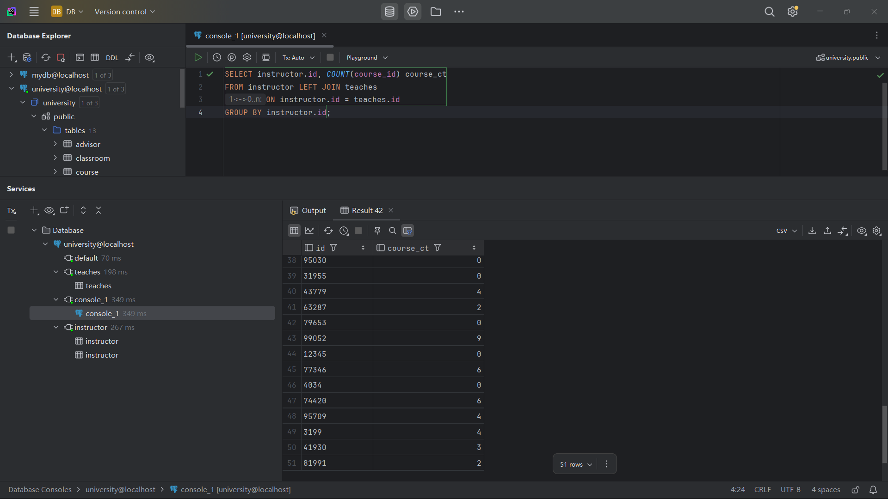
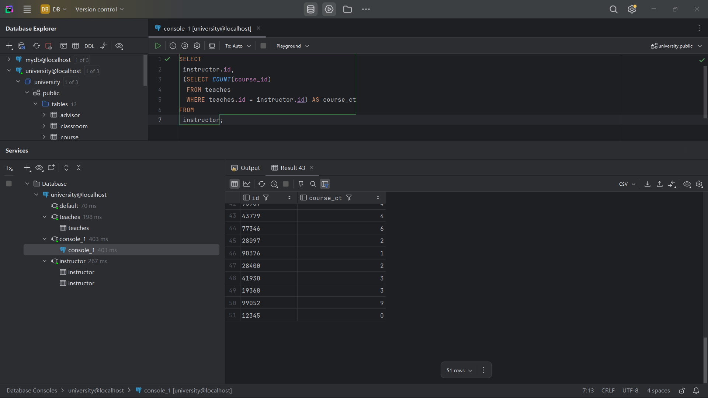
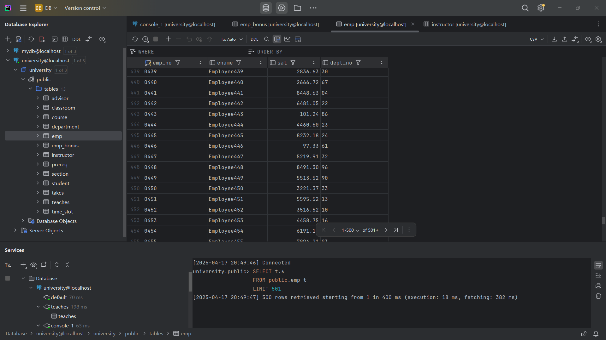
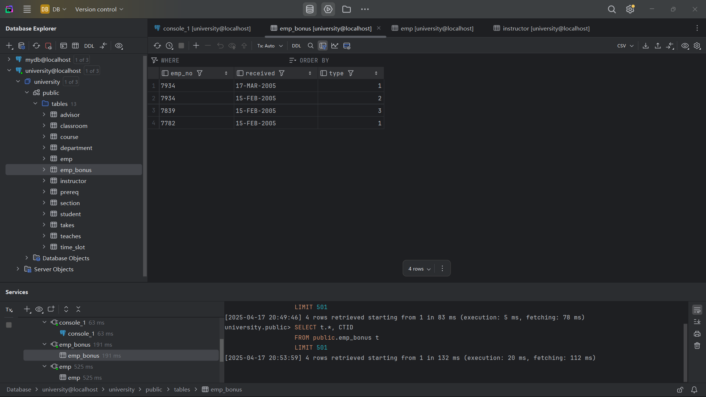

## 数据库原理与应用：测试

### 1. 大学数据库

> ##### 1
>
> ```sql
> SELECT id, COUNT(course_id) course_num
> FROM teaches
> GROUP BY id;
> ```
>
> 
>
> ##### 2
>
> ```sql
> SELECT instructor.id, COUNT(course_id) course_ct
> FROM instructor LEFT JOIN teaches
> ON instructor.id = teaches.id
> GROUP BY instructor.id;
> ```
>
> 
>
> ##### 3
>
> ```sql
> SELECT 
>  instructor.id, 
>  (SELECT COUNT(course_id) 
>   FROM teaches 
>   WHERE teaches.id = instructor.id) AS course_ct
> FROM 
>  instructor;
> ```
>
> 
>
> ##### 4
>
> > 基于takes和student关系可知，加入natural join student会使得两个表依据ID而拼接，但不会增加更多的列数，即不会影响后面where对于表格的行筛选，聚合avg（tot cred）的结果，以及having对于ID的计算
> >
>
> ##### 5
>
> ```sql
> SELECT *
> FROM section JOIN classroom USING(building, room_number);
> ```


### 2. 应用

> ##### 1
>
> ```sql
> CREATE TABLE emp_bonus(
>  emp_no varchar(4),
>  received DATE,  -- 将 received 列改为 DATE 类型
>  type int
> );
> 
> CREATE TABLE emp(
>  emp_no varchar(4) PRIMARY KEY,
>  ename varchar(64),
>  sal numeric(10,2),
>  dept_no varchar(8)
> );
> 
> INSERT INTO emp_bonus(emp_no, received, type)
> VALUES
> (7934, '17-MAR-2005', 1),
> (7934, '15-FEB-2005', 2),
> (7839, '15-FEB-2005', 3),
> (7782, '15-FEB-2005', 1);
> 
> INSERT INTO emp(emp_no, ename, sal, dept_no)
> SELECT
>  LPAD((generate_series)::text, 4, '0') AS emp_no, -- 生成 4 位数的员工编号，如 '0001'
>  'Employee' || generate_series AS ename,          -- 生成员工姓名，如 'Employee1'
>  ROUND((random() * 10000)::numeric, 2) AS sal,    -- 生成随机工资，范围 0 到 10,000
>  LPAD((floor(random() * 99) + 1)::text, 2, '0') AS dept_no -- 生成两位数的部门编号，如 '01'
> FROM generate_series(1, 1000)
> WHERE NOT EXISTS (
>  SELECT 1 FROM emp WHERE emp_no = LPAD((generate_series)::text, 4, '0')
> );
> ```
>
> ##### 2
>
> ```
> SELECT SUM(sal), SUM(bonus), dept_no
> FROM emp_no, emp
> WHERE dept_no = 42
> GROUP BY ID;
> ```
>
> 
>
> 