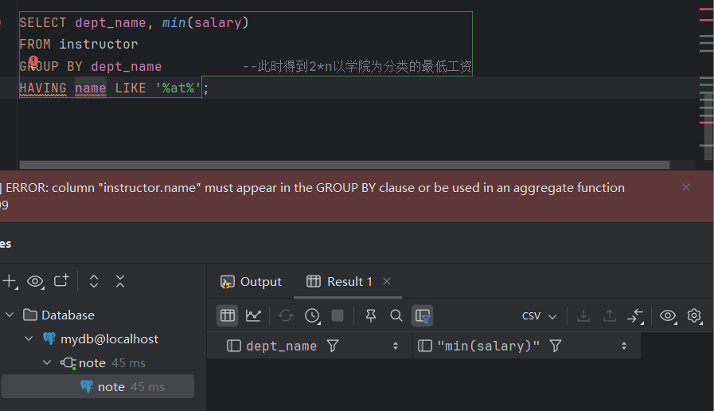

# SQL空值处理及聚集函数

https://github.com/ChenZhongPu/db-swufe/tree/master/05_sql


## 题目一（2分）

##### 请问下面的SQL语句是否合法？用实验验证你的想法。你从实验结果能得到什么结论？


```
SELECT dept_name, min(salary)
FROM instructor;
```

- 猜想：不合法，既有聚合函数又有非聚合函数时需要group by，不然没办法最后生成一个整的`查找关系`

- 验证：为什么如上要求？

  没有group by之前instructor是没有min（salary）列可供筛选的，select只针对输出结果（化简后的关系）进行操作，不能直接对关系产生影响

  

```sql
SELECT dept_name, min(salary)
FROM instructor
GROUP BY dept_name			-- 此时得到2*n以学院为分类的最低工资
HAVING name LIKE '%at%';	-- 改为dept_name就不报错了（虽然出来的是空列表）
```

- 猜想：不可以，经过group by原关系已被筛选，找不到name列。

- 验证：

  

```
SELECT dept_name
FROM instructor
WHERE AVG(salary) > 20000;
```

- 猜想：不可以，此时只有[1*1]的全聚合salary，搜不到dept_name

- 验证：？SQL的每一步的顺序是怎么样的

  【书写逻辑】➡️ select❗️→ from → join on → where → group by → having → order by → limit → 返回结果

  【运行逻辑】➡️from → join on → where → group by → having → select❗️→ order by → limit → 返回结果

  为什么where不可用于聚合函数？where在group by前，会导致全聚合 -- 与select重复或筛选冲突

  


## 题目二（3分+3分+2分）

##### 1. 找到工资最高员工的名字，假设工资最高的员工只有一位（至少两种写法）。

```sql
-- 多位的都可以用（即 n=1 的情况）
```

```sql
-- 1.1 实在想不到还有什么只能用于单个查询的办法
SELECT *
FROM (
    SELECT *,
           ROW_NUMBER() OVER (ORDER BY salary DESC) AS rn
    FROM instructor
) ranked
WHERE rn = 1;
```

```sql
-- 1.2 排序
SELECT *
FROM instructor
ORDER BY salary DESC		-- 默认升序(ASC)
LIMIT 1;

-- Crick 72000.00 (db: mydb)
```

##### 2. 找到工资最高员工的名字，假设工资最高的员工有多位（试试多种写法）。

```sql
-- 2.1 聚合
SELECT name
From instructor
WHERE salary = (SELECT max(salary) FROM instructor);
```

```sql
-- 2.2 条件+聚合
SELECT name,
	CASE
		WHEN salary = (SELECT max(salary) FROM instructor)
			THEN '有最高工资'
		END AS salary_level
FROM instructor
ORDER BY SALARY DESC NULLS LAST;
```

```sql
-- 2.3 in + 聚合
SELECT name
FROM instructor
WHERE salary in (SELECT max(salary) FROM instructor)
```

```sql
-- 2.4 all
SELECT name
FROM instructor
WHERE salary >= ALL (SELECT salary FROM instructor);
```

```sql
-- 2.5 join
SELECT i1.name
FROM instructor i1
LEFT JOIN instructor i2 ON i1.salary < i2.salary
WHERE i2.salary IS NULL;
```

```sql
-- 2.6 排除法
SELECT name
FROM instructor i1
WHERE NOT EXISTS (
  SELECT 1
  FROM instructor i2
  WHERE i2.salary > i1.salary
);
```

##### 3. 解释下面四句。

```sql
-- 均为true

SELECT 1 IN (1);
判断1是否在（1）中

SELECT 1 = (1);		-- (1)只表示一个标量（类似元组在只有一个元素时需要打逗号）
判断1是否等于（1）		-- SELECT (1) = (1,2)就会报错，不同类型不能比较大小

SELECT (1, 2) = (1, 2);
判断（1，2）是否等于（1，2）

SELECT (1) IN (1, 2);	-- 只能判断元素是否在内，如果是（1，2）in（1，2）就会报错
SELECT 1 IN (1, 2);		-- 但是(1, 2)in((1,2))就不会，因为此时已为一个元素
判断（1）是否在（1，2）中	 -- 可见的是不能用(1) in ((1,2))，即用in结合where进行判断时对象必须是表格的一个一阶元素
```