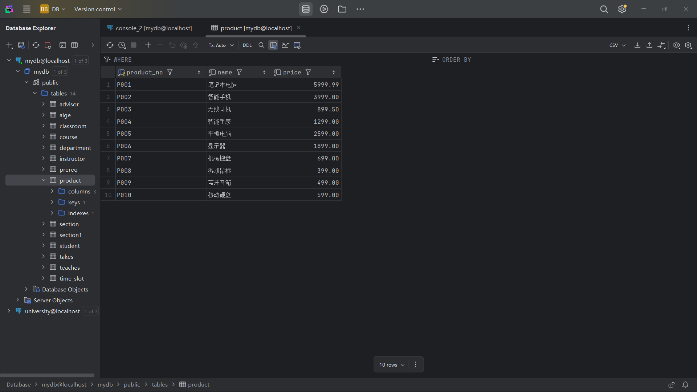

# DDL复习

`product(product_no, name, price)`

## 题目一（4分）

在数据库中创建该关系，并自建上面关系的txt数据文件：

1. 使用`COPY`命令导入数据库（PostgreSQL）；或使用`LOAD DATA`命令导入数据库（MySQL）。
2. 将该关系导出为任意文件（如SQL、Txt、CSV、JSON等）。

```sql
CREATE TABLE product (
    product_no VARCHAR(20) PRIMARY KEY,
    name VARCHAR(100) NOT NULL,
    price DECIMAL(10, 2) NOT NULL
);

COPY product(product_no, name, price)
FROM 'F:\cxing_project\stuff_Notes\Typora\H.W\DB\05.assets\hw.txt'
DELIMITER ',';

COPY product TO 'F:\cxing_project\stuff_Notes\Typora\H.W\DB\05.assets' WITH CSV HEADER;
```




## 题目二（6分）

1. ```sql
   -- 1. 添加一个新的商品，编号为`666`，名字为`cake`，价格不详。
   -- 2. 使用一条SQL语句同时添加3个商品，内容自拟。
   -- 3. 将商品价格统一打8折。
   -- 4. 将价格大于100的商品上涨2%，其余上涨4%。
   -- 5. 将名字包含`cake`的商品删除。
   -- 6. 将价格高于平均价格的商品删除。
   
   -- product(product_no, name, price)
   
   
   
   INSERT INTO product(ID, name) VALUES
   ('666', 'cake');
   
   INSERT INTO product
   VALUES
   (a, b, c),
   (d, e, f),
   (g, h, i);
   
   UPDATE product
   SET price = price*0.8;		-- 安全性报错，再次加载
   
   UPDATE product
   SET price = CASE
   	WHEN price > 100 THEN price*1.02
   	ELSE price*1.04
   	END;
   
   DELETE FROM product
   WHERE name = "%cake%";
   
   SELECT avg(price) avg_price
   FROM product;
   
   DELETE FROM product
   WHERE price > avg(price);
   ```

   


## 题目三（5分）

### 针对PostgreSQL

使用参考下面的语句添加10万条商品，

```
INSERT INTO product (name, price)
SELECT
    'Product' || generate_series, -- 生成名称 Product1, Product2, ...
    ROUND((random() * 1000)::numeric, 2) -- 生成0到1000之间的随机价格，保留2位小数
FROM generate_series(1, 100000);
```

```
INSERT INTO product (product_no, name, price)
SELECT 
    'P' || LPAD(gs::text, 6, '0'),  -- 生成产品编号 P000001, P000002,...P100000
    'Product-' || gs,               -- 生成产品名称 Product-1, Product-2,...Product-100000
    ROUND((random() * 1000)::numeric, 2)  -- 生成0到1000之间的随机价格，保留2位小数
FROM generate_series(1, 100000) AS gs;

-- 验证插入数量
SELECT COUNT(*) FROM product;
```


比较`DELETE`和`TRUNCATE`的性能差异。

> DELETE逐行删除数据，支持条件筛选和事务回滚，但性能较慢；TRUNCATE直接清空表数据页，不可条件删除且多数数据库不可回滚，但执行速度极快。DELETE适合精确删除少量数据，TRUNCATE适合快速清空整个大表。
