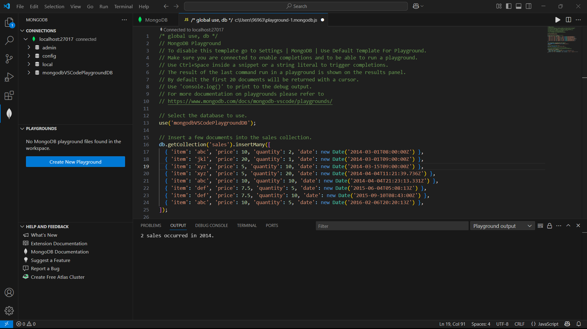

## 安装一个非关系型数据库（不限制），并完成简单的增、删、改、查。需要截图操作。

> 数据库：MongoDB

出现了老问题：

需要先在services.msc启动MongoDB Server

默认安装即可

右边的深绿色按键左边可以打开命令行

VS Code配置：

- 拓展下载官方包然后连接到 mongodb://localhost:27017

命令行：

- 再安装一个MongoShell

  感觉compass用着更舒服，本来compass就有shell功能

基本操作及增删改查：

一开始进去是一个`>test`，代表你正在系统的默认数据库中（空）

> test> help			# 获得帮助
>
> test> cls			# 清屏

基础指令参图

> use game		# 没有则自动创建
>
> 
>
> db.game.insertOne({a:'b'})	# 增，里面的内容可以是用逗号隔开的多个内容，但是整体作为一个插入
>
> db.game.insertMany([{a:1}, {b:2}]	# 放在数组里，每个{}代表一个数据
>
> 
>
> db.game.find()		# 查
>
> db.users.find().limit(1)
>
> ... .sort({level: 1， name: 1})	# -1降序，可根据多个字段排序
>
> ... .skip(1)			# 跳过第1条数据
>
> ... .find({level:3})	# 查询等级为3的
>
> ... ...
>
> 
>
> db.users.updateOne({level: 1}, {$set: {money:100}})		# 不存在则自动创建
>
> a
>
> db.users.deleteOne/Many({a: 1})		# 删除

因为需要创建数据才能进行操作，所以整体打包在一起了

