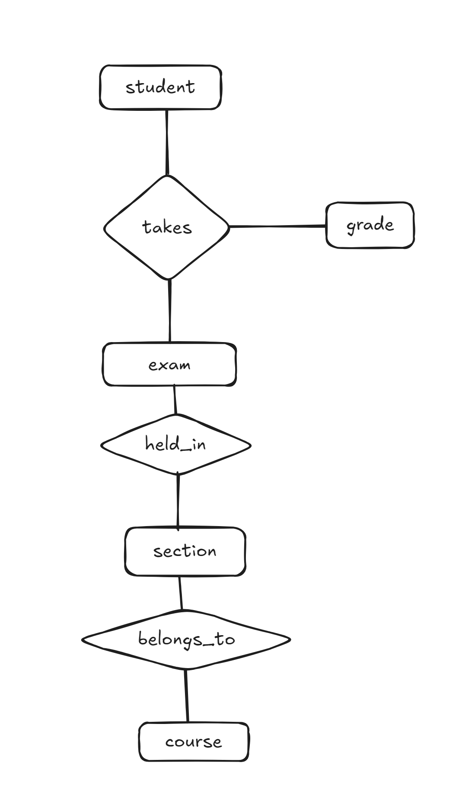

# 本周作业（第8次作业）


## 题目一（3分+2分）


考虑一个用于记录学生（student）在不同课程段（section）在不同考试中取得成绩（grade）的数据库，其中课程段属于某个课程（course）。

1. 绘制E-R图，只用二元联系。确保能够表示一个学生在不同考试中获得的成绩，且一个课程段可能有多次考试。（提示：使用多值属性）

   

2. 写出上面E-R图的关系模式（要求注明主码）。

   ```
   Student(StudentID [PK], Name, Major, ...)
   Course(CourseID [PK], CourseName, ...)
   Section(SectionID [PK], Semester, Instructor, CourseID [FK])
   Exam(ExamID [PK], ExamName, Date, SectionID [FK])
   Grade(StudentID [PK, FK], ExamID [PK, FK], Score)
   ```

   

## 题目二（5分）

如果一个关系模式中只有两个属性，证明该关系模式必定属于BCNF。


从定义来看：对于关系模式 $R$ 中的每一个非平凡函数依赖 $X \rightarrow Y$，若 $X \rightarrow Y$ 是非平凡的（即 $Y \not\subseteq X$），则 **X 是一个超码（superkey）**。

> 设关系模式为 $R(A, B)$，只有两个属性 A 和 B。
>
> 考虑可能的函数依赖关系：
>
> 1. **无非平凡依赖**：满足 BCNF（因为没有违反 BCNF 的依赖）。
> 2. **存在 A → B 且 B → A**：说明 A 和 B 互为候选码，所有非平凡依赖的左边都是超码，满足 BCNF。
> 3. **只有 A → B**：
>    - A 是候选码（能唯一确定整个元组），A 是超码，满足 BCNF。
> 4. **只有 B → A**：
>    - 同理，B 是候选码，是超码，满足 BCNF。
> 5. **只有 {A, B} → A 和 {A, B} → B**（平凡依赖）：满足 BCNF。


## 题目三（5分）


考虑关系模式`r(A, B, C, D, E)`，有如下函数依赖：

- A → BC
- BC → E
- CD → AB

请给出一个满足BCNF的分解，并说明你的分解符合BCNF。

> **（1）原关系 R 是否满足 BCNF？**
>
> - $A \rightarrow B C$ 中 A 不是超码，不满足 BCNF。
>    ⇒ 需分解。
>
> ------
>
> **（2）以 $A \rightarrow B C$ 分解：**
>
> - $R_1(A, B, C)$
> - $R_2(A, D, E)$
>
> ------
>
> **（3）检查 $R_1(A, B, C)$：**
>
> - 有 $A \rightarrow B C$，A 是候选码，满足 BCNF。
>
> ✅ $R_1$ 满足 BCNF。
>
> ------
>
> **（4）检查 $R_2(A, D, E)$：**
>
> - 从原依赖得 $A \rightarrow E$（由 $A \rightarrow B C$，$B C \rightarrow E$ 推出）
> - A 不是 $R_2$ 的超码 ⇒ 违反 BCNF。
>
> ⇒ 继续分解。
>
> ------
>
> **（5）以 $A \rightarrow E$ 分解 $R_2$：**
>
> - $R_3(A, E)$
> - $R_4(A, D)$
>
> ------
>
> **（6）检查 $R_3(A, E)$：**
>
> - 有 $A \rightarrow E$，A 是候选码，满足 BCNF。
>
> ✅ $R_3$ 满足 BCNF。
>
> ------
>
> **（7）检查 $R_4(A, D)$：**
>
> - 无非平凡依赖，自动满足 BCNF。
>
> ✅ $R_4$ 满足 BCNF。
>
> ------
>
> **最终结果：BCNF 分解为如下三个关系模式：**
>
> 1. $R_1(A, B, C)$，满足 BCNF
> 2. $R_3(A, E)$，满足 BCNF
> 3. $R_4(A, D)$，满足 BCNF